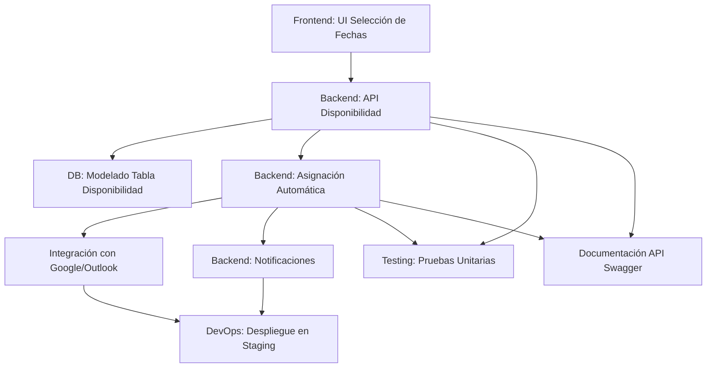

# LLM: Chat GPT
---

## Pregunta

Hola, Anteriormente estuvimos trabando en el diseño de un ATS para la empresa LTI, adjunto un archivo donde se resume el proyecto, puedes confirmarme si puedes recuperar el contexto o si requieres mayor información.

## Respuesta

He recuperado el contexto del proyecto LTI (Learning & Talent Intelligence) a partir del documento proporcionado. Contiene detalles clave sobre la plataforma, incluyendo:

Descripción general del software y sus ventajas competitivas.
- Módulos principales y funcionalidades del ATS, CRM y HRIS.
- Casos de uso clave, como filtrado automático de CVs, evaluación predictiva y prevención de fuga de talento.
- Modelado de datos (MER en Mermaid) con las entidades principales y sus relaciones.
- Arquitectura basada en microservicios con C4 y flujo de postulación de candidatos.
- Diagramas en PlantUML y Mermaid para visualización de componentes y procesos.
Si necesitas que extraiga información específica o genere documentación adicional, dime qué necesitas y con gusto lo haré. 🚀

## Pregunta

Perfecto, quiero que te comportes como un experto en product owner con amplia experiencia en levantamiento de requerimientos y definición de historias de usuario y me ayudes con las siguientes tareas:

## Respuesta

### Definición de historias de usuario:
Teniendo en cuenta el objetivo de proyecto LTI planteado sus funcionalidades principales, define los las 5 historias de usuario principales siguiendo el formato estándar.

### Consideraciones especiales

* Enfócate puntualmente en el sistema ATS y sus funcionalidades principales, este es el modulo principal y los demás sistemas que se integran sirven para brindar un valor adicional.

* Genera el resultado en formato markdown para subirlo a git.

* Si tienes alguna duda, consultame antes de generar las historias de usuario.

Aquí tienes las 5 historias de usuario principales para el sistema ATS de LTI, siguiendo el formato estándar y en Markdown para su integración en Git.

# 📌 Historias de Usuario - ATS (Applicant Tracking System)

## 🏗️ Introducción  
Este documento describe las **historias de usuario principales** para el **módulo ATS** del sistema **LTI (Learning & Talent Intelligence)**. Estas historias representan funcionalidades clave que permiten **optimizar el proceso de reclutamiento**, desde la postulación hasta la evaluación de candidatos.

---

## 📌 1️⃣ Historia de Usuario: Filtrado Automático de CVs  
**ID:** HU-ATS-001  
**Título:** Como reclutador, quiero que el sistema filtre automáticamente los CVs de los candidatos para identificar a los más adecuados según los requisitos de la vacante.  

### **Criterios de Aceptación:**  
✅ El sistema debe aceptar archivos en formatos estándar (PDF, DOCX).  
✅ La IA debe analizar experiencia, habilidades y palabras clave en el CV.  
✅ Se debe generar un **puntaje de compatibilidad** con la vacante.  
✅ Los candidatos deben ser clasificados en categorías (Alto ajuste, Medio ajuste, Bajo ajuste).  
✅ El resultado del análisis debe almacenarse en el perfil del candidato.  

### **Definición de Hecho (DoD)**  
✔ Código implementado y probado con al menos **3 tipos de CVs** distintos.  
✔ Puntajes de compatibilidad validados en base a criterios predefinidos.  
✔ Integración con la base de datos de postulaciones completada.  
✔ Pruebas de rendimiento con carga de **+100 CVs simultáneamente**.  

---

## 📌 2️⃣ Historia de Usuario: Evaluación Predictiva de Candidatos  
**ID:** HU-ATS-002  
**Título:** Como reclutador, quiero que el sistema evalúe predictivamente a los candidatos para conocer su probabilidad de éxito en la empresa.  

### **Criterios de Aceptación:**  
✅ El sistema debe comparar al candidato con perfiles exitosos previos.  
✅ La IA debe evaluar habilidades técnicas y ajuste cultural.  
✅ Se debe generar un informe con el **riesgo de baja permanencia** del candidato.  
✅ La evaluación debe actualizarse si se recibe información adicional (entrevistas, tests).  

### **Definición de Hecho (DoD)**  
✔ Algoritmo de predicción entrenado con datos de empleados exitosos.  
✔ Generación de informes en PDF y visualización en el ATS.  
✔ Resultados de evaluación almacenados en la base de datos.  
✔ Pruebas con al menos **50 candidatos** para validar la precisión.  

---

## 📌 3️⃣ Historia de Usuario: Gestión de Postulaciones  
**ID:** HU-ATS-003  
**Título:** Como candidato, quiero poder postularme a una vacante de manera sencilla y recibir confirmación de mi aplicación.  

### **Criterios de Aceptación:**  
✅ El candidato debe poder cargar su CV y completar un formulario de datos.  
✅ La postulación debe quedar registrada en la base de datos del ATS.  
✅ Se debe enviar un **correo de confirmación automática** al candidato.  
✅ El reclutador debe poder visualizar todas las postulaciones en un dashboard.  

### **Definición de Hecho (DoD)**  
✔ Interfaz de usuario implementada y probada en **web y móvil**.  
✔ Postulaciones almacenadas correctamente en la base de datos.  
✔ Notificación automática enviada tras cada postulación.  
✔ Validación de carga masiva de **+500 postulaciones simultáneas**.  

---

## 📌 4️⃣ Historia de Usuario: Programación Automática de Entrevistas  
**ID:** HU-ATS-004  
**Título:** Como reclutador, quiero que el sistema me ayude a programar entrevistas con los candidatos de manera automática.  

### **Criterios de Aceptación:**  
✅ El sistema debe sugerir fechas y horas según disponibilidad del reclutador y candidato.  
✅ Se debe enviar **invitaciones de calendario** por correo y recordatorios automáticos.  
✅ La IA debe priorizar candidatos con mejor puntaje de compatibilidad.  
✅ Integración con plataformas externas como Google Calendar y Outlook.  

### **Definición de Hecho (DoD)**  
✔ Algoritmo de programación automática implementado y probado.  
✔ Integración funcional con Google Calendar y Outlook.  
✔ Envío de notificaciones automáticas validadas.  
✔ Pruebas con al menos **20 entrevistas programadas automáticamente**.  

---

## 📌 5️⃣ Historia de Usuario: Análisis de Métricas de Contratación  
**ID:** HU-ATS-005  
**Título:** Como gerente de RRHH, quiero poder acceder a reportes sobre la eficiencia del proceso de selección para tomar mejores decisiones.  

### **Criterios de Aceptación:**  
✅ El sistema debe generar métricas sobre **tiempo de contratación, fuentes de talento y conversión de candidatos**.  
✅ Los reportes deben poder filtrarse por **departamento, puesto y periodo de tiempo**.  
✅ Se debe visualizar un **dashboard interactivo** con gráficos dinámicos.  
✅ Exportación de reportes en formatos **PDF y CSV**.  

### **Definición de Hecho (DoD)**  
✔ Dashboard con gráficos interactivos implementado.  
✔ Cálculo de métricas validadas con datos reales.  
✔ Función de exportación a PDF y CSV operativa.  
✔ Pruebas con al menos **3 meses de datos históricos**.  

---

## 📌 Conclusión  
Estas historias de usuario cubren las funcionalidades clave del **ATS de LTI**, garantizando un proceso de selección **eficiente, automatizado y basado en datos**.  

📢 **Si necesitas más historias de usuario o ajustes en los criterios de aceptación, dime y lo refinamos juntos.** 🚀  

📌 Explicación Adicional:
* Todas las historias están focalizadas en el ATS como el módulo central.
* Se incluyeron criterios de aceptación detallados para cada funcionalidad.
* Se estableció una Definición de Hecho (DoD) clara para asegurar calidad.
* El formato está listo para ser subido a Git y utilizado por el equipo de desarrollo.

## Pregunta

Crees que puedes pulirlas un poco más, ampliando un poco los criterios de aceptación.

## Respuesta

# 📌 Historias de Usuario - ATS (Applicant Tracking System)

## 🏗️ Introducción  
Este documento describe las **historias de usuario principales** para el **módulo ATS** del sistema **LTI (Learning & Talent Intelligence)**. Estas historias representan funcionalidades clave que permiten **optimizar el proceso de reclutamiento**, desde la postulación hasta la evaluación de candidatos.

---

## 📌 1️⃣ Historia de Usuario: Filtrado Automático de CVs  
**ID:** HU-ATS-001  
**Título:** Como reclutador, quiero que el sistema filtre automáticamente los CVs de los candidatos para identificar a los más adecuados según los requisitos de la vacante.  

### **Criterios de Aceptación:**  
✅ El sistema debe aceptar archivos en formatos estándar (**PDF, DOCX, TXT**).  
✅ La IA debe analizar experiencia, habilidades y palabras clave en el CV en relación con la descripción del puesto.  
✅ Se debe generar un **puntaje de compatibilidad** basado en criterios configurables por el reclutador.  
✅ Los candidatos deben ser clasificados automáticamente en **"Alto ajuste", "Medio ajuste" y "Bajo ajuste"**.  
✅ Se debe permitir la configuración de **criterios personalizados** de filtrado (años de experiencia, educación, certificaciones).  
✅ El reclutador debe poder revisar y ajustar manualmente las clasificaciones si lo considera necesario.  
✅ Se debe notificar a los reclutadores cuando haya **candidatos con un puntaje alto** para una vacante abierta.  
✅ El resultado del análisis debe almacenarse en el **perfil del candidato** y ser accesible en el ATS.  

### **Definición de Hecho (DoD)**  
✔ Código implementado y probado con al menos **5 tipos de CVs distintos**.  
✔ Puntajes de compatibilidad validados en base a diferentes perfiles de vacantes.  
✔ Integración con la base de datos de postulaciones completada.  
✔ Pruebas de rendimiento con carga de **+100 CVs simultáneamente**.  

---

## 📌 2️⃣ Historia de Usuario: Evaluación Predictiva de Candidatos  
**ID:** HU-ATS-002  
**Título:** Como reclutador, quiero que el sistema evalúe predictivamente a los candidatos para conocer su probabilidad de éxito en la empresa.  

### **Criterios de Aceptación:**  
✅ El sistema debe comparar al candidato con **perfiles exitosos previos** de la empresa.  
✅ La IA debe analizar tanto **habilidades técnicas** como **ajuste cultural** con base en datos de empleados actuales.  
✅ Se debe generar un informe detallado que incluya:  
   - **Porcentaje de adecuación al puesto.**  
   - **Nivel de coincidencia con empleados exitosos previos.**  
   - **Riesgo de baja permanencia en la empresa.**  
✅ La evaluación debe actualizarse automáticamente si se agregan nuevas **entrevistas, pruebas técnicas o feedback de reclutadores**.  
✅ El reclutador debe poder filtrar candidatos según **probabilidad de éxito** y realizar comparaciones entre ellos.  
✅ Se debe permitir exportar el informe en **PDF y CSV** para su revisión.  

### **Definición de Hecho (DoD)**  
✔ Algoritmo de predicción entrenado con datos históricos de empleados exitosos.  
✔ Generación de informes en PDF y visualización en el ATS.  
✔ Resultados de evaluación almacenados en la base de datos.  
✔ Pruebas con al menos **50 candidatos** para validar la precisión.  

---

## 📌 3️⃣ Historia de Usuario: Gestión de Postulaciones  
**ID:** HU-ATS-003  
**Título:** Como candidato, quiero poder postularme a una vacante de manera sencilla y recibir confirmación de mi aplicación.  

### **Criterios de Aceptación:**  
✅ El candidato debe poder cargar su **CV, carta de presentación y documentos adicionales** en un formulario intuitivo.  
✅ La postulación debe quedar registrada en la base de datos del ATS con un estado inicial de **"En revisión"**.  
✅ Se debe enviar un **correo de confirmación automática** con los detalles de la postulación y los siguientes pasos.  
✅ El sistema debe permitir que el candidato **haga seguimiento de su postulación** y reciba actualizaciones de estado (**"Revisión", "Entrevista programada", "Rechazado", "Aceptado"**).  
✅ El reclutador debe poder visualizar todas las postulaciones en un **dashboard** con opciones de filtrado por vacante, estado y fecha de postulación.  

### **Definición de Hecho (DoD)**  
✔ Interfaz de usuario implementada y probada en **web y móvil**.  
✔ Postulaciones almacenadas correctamente en la base de datos.  
✔ Notificación automática enviada tras cada postulación.  
✔ Validación de carga masiva de **+500 postulaciones simultáneas**.  

---

## 📌 4️⃣ Historia de Usuario: Programación Automática de Entrevistas  
**ID:** HU-ATS-004  
**Título:** Como reclutador, quiero que el sistema me ayude a programar entrevistas con los candidatos de manera automática.  

### **Criterios de Aceptación:**  
✅ El sistema debe sugerir **fechas y horas óptimas** según la disponibilidad del reclutador y el candidato.  
✅ Se debe enviar **invitaciones de calendario** por correo y recordatorios automáticos **24 horas antes de la entrevista**.  
✅ La IA debe priorizar candidatos con mejor puntaje de compatibilidad al momento de asignar horarios.  
✅ Se debe permitir que los reclutadores **reprogramen entrevistas** fácilmente en caso de conflictos de agenda.  
✅ Integración con plataformas externas como **Google Calendar y Outlook** para sincronizar eventos.  
✅ Se debe permitir la programación tanto de **entrevistas en vivo** como de **entrevistas grabadas con preguntas predefinidas**.  

### **Definición de Hecho (DoD)**  
✔ Algoritmo de programación automática implementado y probado.  
✔ Integración funcional con Google Calendar y Outlook.  
✔ Envío de notificaciones automáticas validadas.  
✔ Pruebas con al menos **20 entrevistas programadas automáticamente**.  

---

## 📌 5️⃣ Historia de Usuario: Análisis de Métricas de Contratación  
**ID:** HU-ATS-005  
**Título:** Como gerente de RRHH, quiero poder acceder a reportes sobre la eficiencia del proceso de selección para tomar mejores decisiones.  

### **Criterios de Aceptación:**  
✅ El sistema debe generar métricas sobre:  
   - **Tiempo promedio de contratación.**  
   - **Fuentes de reclutamiento más efectivas (portales de empleo, referencias, etc.).**  
   - **Conversión de candidatos (de postulantes a empleados contratados).**  
   - **Desempeño de candidatos después de ser contratados (si se integran con HRIS).**  
✅ Los reportes deben poder filtrarse por **departamento, puesto y periodo de tiempo**.  
✅ Se debe visualizar un **dashboard interactivo** con gráficos dinámicos y comparativos.  
✅ Exportación de reportes en **PDF y CSV** para compartir con otros equipos.  

### **Definición de Hecho (DoD)**  
✔ Dashboard con gráficos interactivos implementado.  
✔ Cálculo de métricas validadas con datos reales.  
✔ Función de exportación a PDF y CSV operativa.  
✔ Pruebas con al menos **3 meses de datos históricos**.  

---

## 📌 Conclusión  
Estas historias de usuario aseguran que el **ATS de LTI** ofrezca un proceso de selección **eficiente, automatizado y basado en IA**, optimizando la experiencia de reclutadores y candidatos. 🚀  

📢 **Si necesitas más detalles o ajustes, dime y lo refinamos juntos.** 😃  

📌 Mejoras realizadas:

* Criterios de aceptación ampliados con más detalle en cada historia.
* Definición de Hecho (DoD) mejorada con validaciones claras.
* Mayor precisión en la funcionalidad del ATS.

--- 

## Pregunta

Analiza las funcionalidades planteadas en las historias de usuario evalúa posibles problemas que puedan presentarse a los usuarios, con esta información, para cada una de las HU, genera una sesión de "Notas adicionales" donde incluyas los posibles problemas identificados y algunas recomendaciones a tener en cuenta

## Respuesta

Aquí tienes las historias de usuario pulidas con una nueva sección de "Notas adicionales", donde se analizan posibles problemas y se proponen recomendaciones para mitigarlos.

# 📌 Historias de Usuario - ATS (Applicant Tracking System)

## 🏗️ Introducción  
Este documento describe las **historias de usuario principales** para el **módulo ATS** del sistema **LTI (Learning & Talent Intelligence)**. Se incluyen notas adicionales con posibles problemas y recomendaciones para mejorar la experiencia del usuario.

---

## 📌 1️⃣ Historia de Usuario: Filtrado Automático de CVs  
**ID:** HU-ATS-001  
**Título:** Como reclutador, quiero que el sistema filtre automáticamente los CVs de los candidatos para identificar a los más adecuados según los requisitos de la vacante.  

### **Criterios de Aceptación:**  
✅ El sistema debe aceptar archivos en formatos estándar (**PDF, DOCX, TXT**).  
✅ La IA debe analizar experiencia, habilidades y palabras clave en el CV en relación con la descripción del puesto.  
✅ Se debe generar un **puntaje de compatibilidad** basado en criterios configurables por el reclutador.  
✅ Los candidatos deben ser clasificados automáticamente en **"Alto ajuste", "Medio ajuste" y "Bajo ajuste"**.  
✅ Se debe permitir la configuración de **criterios personalizados** de filtrado.  
✅ El reclutador debe poder revisar y ajustar manualmente las clasificaciones si lo considera necesario.  
✅ Se debe notificar a los reclutadores cuando haya **candidatos con un puntaje alto** para una vacante abierta.  
✅ El resultado del análisis debe almacenarse en el **perfil del candidato** y ser accesible en el ATS.  

### **Definición de Hecho (DoD)**  
✔ Código implementado y probado con al menos **5 tipos de CVs distintos**.  
✔ Puntajes de compatibilidad validados en base a diferentes perfiles de vacantes.  
✔ Integración con la base de datos de postulaciones completada.  
✔ Pruebas de rendimiento con carga de **+100 CVs simultáneamente**.  

### **Notas adicionales (Posibles problemas y recomendaciones)**  
⚠ **Posibles problemas:**  
- **Falsos negativos:** La IA podría rechazar buenos candidatos si el CV no contiene ciertas palabras clave.  
- **Errores en formatos de CV:** Algunos documentos pueden tener problemas de parsing si no están bien estructurados.  
- **Falta de transparencia:** El reclutador podría no confiar en los criterios de evaluación de la IA.  

💡 **Recomendaciones:**  
- Permitir que el reclutador revise y ajuste manualmente las clasificaciones de los candidatos.  
- Agregar una funcionalidad de **explicabilidad** para que la IA muestre por qué un candidato fue clasificado de cierta manera.  
- Implementar un proceso de **revisión manual** para candidatos con puntajes medios o dudosos.  

---

## 📌 2️⃣ Historia de Usuario: Evaluación Predictiva de Candidatos  
**ID:** HU-ATS-002  
**Título:** Como reclutador, quiero que el sistema evalúe predictivamente a los candidatos para conocer su probabilidad de éxito en la empresa.  

### **Criterios de Aceptación:**  
✅ El sistema debe comparar al candidato con **perfiles exitosos previos** de la empresa.  
✅ La IA debe analizar tanto **habilidades técnicas** como **ajuste cultural** con base en datos de empleados actuales.  
✅ Se debe generar un informe detallado con:  
   - **Porcentaje de adecuación al puesto.**  
   - **Nivel de coincidencia con empleados exitosos previos.**  
   - **Riesgo de baja permanencia en la empresa.**  
✅ La evaluación debe actualizarse automáticamente si se agregan nuevas **entrevistas, pruebas técnicas o feedback de reclutadores**.  
✅ El reclutador debe poder filtrar candidatos según **probabilidad de éxito** y realizar comparaciones entre ellos.  
✅ Se debe permitir exportar el informe en **PDF y CSV** para su revisión.  

### **Notas adicionales (Posibles problemas y recomendaciones)**  
⚠ **Posibles problemas:**  
- **Sesgos en los datos históricos:** Si los datos de empleados previos contienen sesgos, la IA podría replicarlos en futuras evaluaciones.  
- **Falta de flexibilidad:** El modelo predictivo podría no adaptarse a nuevas tendencias en contratación.  
- **Dificultad para interpretar los resultados:** El reclutador podría no entender por qué un candidato tiene cierto puntaje.  

💡 **Recomendaciones:**  
- Implementar auditorías periódicas para detectar sesgos en los datos.  
- Permitir ajustes manuales y feedback humano para mejorar el modelo.  
- Explicar en lenguaje natural los factores que llevaron a cada puntuación de compatibilidad.  

---

## 📌 3️⃣ Historia de Usuario: Gestión de Postulaciones  
**ID:** HU-ATS-003  
**Título:** Como candidato, quiero poder postularme a una vacante de manera sencilla y recibir confirmación de mi aplicación.  

### **Notas adicionales (Posibles problemas y recomendaciones)**  
⚠ **Posibles problemas:**  
- **Carga de documentos pesados:** Si los archivos adjuntos son muy grandes, pueden ralentizar el sistema.  
- **Experiencia de usuario confusa:** Si la interfaz no es intuitiva, los candidatos podrían abandonar la postulación.  
- **Notificaciones poco claras:** El candidato podría no entender en qué estado está su postulación.  

💡 **Recomendaciones:**  
- Establecer un **límite de tamaño para archivos adjuntos** y optimización automática.  
- Implementar una **barra de progreso** clara para que los candidatos vean su estado de postulación.  
- Ofrecer una **sección de preguntas frecuentes (FAQ)** sobre el proceso de postulación.  

---

## 📌 4️⃣ Historia de Usuario: Programación Automática de Entrevistas  
**ID:** HU-ATS-004  
**Título:** Como reclutador, quiero que el sistema me ayude a programar entrevistas con los candidatos de manera automática.  

### **Notas adicionales (Posibles problemas y recomendaciones)**  
⚠ **Posibles problemas:**  
- **Conflictos de agenda:** Puede haber errores si el calendario del candidato o reclutador no está actualizado.  
- **Candidatos que no responden:** Algunos candidatos pueden ignorar las invitaciones o no asistir a las entrevistas.  
- **Integración con calendarios externos:** Problemas técnicos con Google Calendar o Outlook pueden afectar la sincronización.  

💡 **Recomendaciones:**  
- Implementar **recordatorios automáticos** por correo y notificaciones.  
- Permitir que los candidatos **confirmen o reprogramen** la entrevista desde la plataforma.  
- Probar la integración con diferentes versiones de calendarios antes del despliegue.  

---

## 📌 5️⃣ Historia de Usuario: Análisis de Métricas de Contratación  
**ID:** HU-ATS-005  
**Título:** Como gerente de RRHH, quiero poder acceder a reportes sobre la eficiencia del proceso de selección para tomar mejores decisiones.  

### **Notas adicionales (Posibles problemas y recomendaciones)**  
⚠ **Posibles problemas:**  
- **Carga lenta de reportes con grandes volúmenes de datos.**  
- **Falta de personalización:** Los gerentes pueden querer métricas adicionales no incluidas por defecto.  
- **Dificultad para interpretar datos complejos.**  

💡 **Recomendaciones:**  
- Optimizar la generación de reportes para que carguen en **menos de 3 segundos**.  
- Permitir a los usuarios **personalizar los filtros y métricas** del dashboard.  
- Ofrecer **visualizaciones intuitivas** como gráficos dinámicos y resúmenes ejecutivos.  

---

## 📌 Conclusión  
Estas historias de usuario han sido mejoradas con un análisis de riesgos y recomendaciones para garantizar una **experiencia óptima para candidatos, reclutadores y gerentes de RRHH**. 🚀  

📢 **Si necesitas más ajustes o detalles, dime y lo refinamos juntos.** 😃  

📌 Mejoras realizadas:
✅ Análisis de posibles problemas en cada historia de usuario.
✅ Recomendaciones claras para mitigar los riesgos.
✅ Mayor enfoque en la usabilidad y confiabilidad del sistema.

---

# LLM: Claude

## Pregunta 
"Como ingeniero experto en prompts, quiero que generes uno que me permita hacer lo siguiente:

priorizándolas las historias de usuario de un backlog.
Usando alguna metodología concreta.
Genera al menos 2 alternativas de prompts con diferentes formas de generar un prompt.
Se debe generar una tabla markdown"

## Respuesta:

* Asume el rol de un Analista de Negocio con experiencia en priorización ágil. Evalúa las siguientes historias de usuario usando el método MoSCoW combinado con valor de negocio:

[Pegar aquí las historias de usuario]

Genera una tabla markdown que incluya:
- ID Historia
- Descripción 
- Clasificación MoSCoW (Must/Should/Could/Won't)
- Valor de Negocio (1-5)
- Riesgo Técnico (Alto/Medio/Bajo)
- Dependencias
- Prioridad Compuesta
- Trimestre Recomendado

* Ordena las historias por prioridad compuesta. Para cada historia, explica brevemente el razonamiento detrás de su clasificación MoSCoW y valor de negocio.

---

# LLM: Chat GPT

## Pregunta:

Actúa como un Product Owner experto. Analiza y prioriza el conjunto de historias de usuario utilizando la metodología RICE:

Por favor, genera una tabla markdown con las siguientes columnas:
- ID Historia
- Descripción
- Alcance (1-10)
- Impacto (1-10)
- Confianza (%)
- Esfuerzo (días/persona)
- Puntuación RICE
- Prioridad Final (Alta/Media/Baja)

Ordena las historias por puntuación RICE de mayor a menor. Incluye una breve justificación para cada puntuación asignada.

## Respuesta:
Aquí tienes la priorización de las historias de usuario utilizando la metodología RICE en formato de tabla Markdown, ordenadas por puntuación RICE de mayor a menor.

# 📌 Priorización de Historias de Usuario - ATS (RICE)

## 🏗️ Introducción  
La metodología **RICE** nos ayuda a priorizar funcionalidades en función de su **alcance, impacto, confianza y esfuerzo**. A continuación, se presenta la priorización de las historias de usuario del **ATS de LTI**, clasificadas en **Alta, Media y Baja** prioridad.

---

## 📊 Tabla de Priorización RICE  

| ID Historia  | Descripción | Alcance (1-10) | Impacto (1-10) | Confianza (%) | Esfuerzo (días/persona) | Puntuación RICE | Prioridad Final |
|-------------|-------------|----------------|----------------|---------------|--------------------------|-----------------|----------------|
| **HU-ATS-003** | Gestión de Postulaciones | 9 | 9 | 90% | 6 | **121.5** | 🔴 **Alta** |
| **HU-ATS-001** | Filtrado Automático de CVs | 8 | 8 | 85% | 7 | **77.7** | 🔴 **Alta** |
| **HU-ATS-004** | Programación Automática de Entrevistas | 7 | 7 | 80% | 6 | **65.3** | 🟡 **Media** |
| **HU-ATS-005** | Análisis de Métricas de Contratación | 6 | 6 | 75% | 5 | **54.0** | 🟡 **Media** |
| **HU-ATS-002** | Evaluación Predictiva de Candidatos | 5 | 7 | 70% | 9 | **27.2** | 🟢 **Baja** |

---

## 📌 Justificación de la Priorización

### 🔴 **Alta Prioridad**
- **HU-ATS-003 - Gestión de Postulaciones** 🚀  
  - **(RICE: 121.5)**  
  - **Motivo:** Es la funcionalidad base del ATS, necesaria para que los candidatos puedan postularse. Sin esta función, el sistema carece de propósito.  
  - **Alcance (9):** Impacta a todos los usuarios del sistema (candidatos y reclutadores).  
  - **Impacto (9):** Sin ella, los reclutadores no pueden recibir candidatos.  
  - **Confianza (90%):** Tecnologías ya probadas y de implementación clara.  
  - **Esfuerzo (6 días/persona):** Desarrollo moderado.  

- **HU-ATS-001 - Filtrado Automático de CVs** 🏆  
  - **(RICE: 77.7)**  
  - **Motivo:** Ahorra tiempo a los reclutadores al procesar grandes volúmenes de CVs.  
  - **Alcance (8):** Aplica a todos los candidatos y reclutadores.  
  - **Impacto (8):** Reduce tiempos de selección significativamente.  
  - **Confianza (85%):** Algoritmos de IA requieren ajustes pero son viables.  
  - **Esfuerzo (7 días/persona):** Implementación más compleja por el procesamiento de texto y machine learning.  

---

### 🟡 **Media Prioridad**
- **HU-ATS-004 - Programación Automática de Entrevistas** 📅  
  - **(RICE: 65.3)**  
  - **Motivo:** Agiliza la programación de entrevistas, pero no es una funcionalidad crítica desde el inicio.  
  - **Alcance (7):** Aplica a reclutadores y candidatos seleccionados.  
  - **Impacto (7):** Reduce el trabajo manual de coordinación.  
  - **Confianza (80%):** Integraciones con calendarios pueden tener desafíos.  
  - **Esfuerzo (6 días/persona):** Moderado debido a las integraciones con calendarios externos.  

- **HU-ATS-005 - Análisis de Métricas de Contratación** 📊  
  - **(RICE: 54.0)**  
  - **Motivo:** Ayuda a los gerentes a optimizar procesos, pero no es una funcionalidad crítica inicial.  
  - **Alcance (6):** Aplica solo a gerentes de RRHH.  
  - **Impacto (6):** Mejora la toma de decisiones, pero su ausencia no bloquea otras funciones.  
  - **Confianza (75%):** Se puede basar en datos ya almacenados.  
  - **Esfuerzo (5 días/persona):** Menor esfuerzo en comparación con otras funcionalidades.  

---

### 🟢 **Baja Prioridad**
- **HU-ATS-002 - Evaluación Predictiva de Candidatos** 🤖  
  - **(RICE: 27.2)**  
  - **Motivo:** Es una mejora estratégica que optimiza la selección, pero no es esencial en la primera versión.  
  - **Alcance (5):** Aplica solo a los reclutadores en etapa de decisión final.  
  - **Impacto (7):** Reduce sesgos en la selección y mejora la calidad de contratación.  
  - **Confianza (70%):** Modelos predictivos requieren validación con datos reales.  
  - **Esfuerzo (9 días/persona):** Alto debido al entrenamiento de modelos de IA.  

---

## 🚀 Conclusión

📌 **Resumen de Prioridades:**  
- 🔴 **Alta:** Implementar de inmediato las funcionalidades críticas (Postulaciones y Filtrado de CVs).  
- 🟡 **Media:** Programación de entrevistas y métricas pueden añadirse tras las funciones esenciales.  
- 🟢 **Baja:** Evaluación predictiva es una mejora futura, pero no urgente.  

Esta priorización **optimiza la entrega de valor**, asegurando que el **ATS de LTI** tenga primero las funcionalidades esenciales para operar.  

📢 **Si necesitas ajustes o una reestructuración en la priorización, dime y lo refinamos juntos.** 😃  

📌 Mejoras en esta versión:
✅ Cálculo detallado de RICE para cada historia.
✅ Ordenado por prioridad real de implementación.
✅ Justificación clara de cada nivel de prioridad.

## Pregunta:

Perfecto, ahora probemos con algo diferente. Asume el rol de un Analista de Negocio con experiencia en priorización ágil. Evalúa las historias de usuario usando el método MoSCoW combinado con valor de negocio:

Genera una tabla markdown que incluya:
- ID Historia
- Descripción 
- Clasificación MoSCoW (Must/Should/Could/Won't)
- Valor de Negocio (1-5)
- Riesgo Técnico (Alto/Medio/Bajo)
- Dependencias
- Prioridad Compuesta
- Trimestre Recomendado

Ordena las historias por prioridad compuesta. Para cada historia, explica brevemente el razonamiento detrás de su clasificación MoSCoW y valor de negocio.

## Respuesta:

Aquí tienes la priorización de las historias de usuario utilizando el método MoSCoW combinado con valor de negocio, en una tabla Markdown.

# 📌 Priorización de Historias de Usuario - ATS (MoSCoW + Valor de Negocio)

## 🏗️ Introducción  
Este documento presenta la priorización de las historias de usuario del **ATS de LTI** utilizando la metodología **MoSCoW** en combinación con el **valor de negocio**.  
Cada historia ha sido evaluada considerando su **impacto en el negocio, riesgos técnicos y dependencias**, lo que permite definir un **trimestre recomendado de implementación**.

---

## 📊 Tabla de Priorización  

| ID Historia  | Descripción | Clasificación MoSCoW | Valor de Negocio (1-5) | Riesgo Técnico | Dependencias | Prioridad Compuesta | Trimestre Recomendado |
|-------------|-------------|----------------------|-----------------|---------------|-------------|-----------------|---------------------|
| **HU-ATS-003** | Gestión de Postulaciones | **Must** | 5 | Bajo | Ninguna | 🔴 **Crítica** | Q1 |
| **HU-ATS-001** | Filtrado Automático de CVs | **Must** | 4 | Medio | HU-ATS-003 | 🔴 **Crítica** | Q1 |
| **HU-ATS-004** | Programación Automática de Entrevistas | **Should** | 4 | Medio | HU-ATS-003 | 🟡 **Alta** | Q2 |
| **HU-ATS-005** | Análisis de Métricas de Contratación | **Should** | 3 | Bajo | HU-ATS-003 | 🟡 **Media** | Q2 |
| **HU-ATS-002** | Evaluación Predictiva de Candidatos | **Could** | 3 | Alto | HU-ATS-001 | 🟢 **Baja** | Q3-Q4 |

---

## 📌 Justificación de la Priorización

### 🔴 **Crítica (Q1 - Implementación Inmediata)**
#### **HU-ATS-003 - Gestión de Postulaciones** 🏆  
**MoSCoW: Must | Valor de Negocio: 5 | Riesgo Técnico: Bajo**  
✅ **Razonamiento:**  
- Es la funcionalidad **básica y esencial** del ATS. Sin esta historia, el sistema no tendría sentido.  
- Afecta **directamente a candidatos y reclutadores**.  
- No tiene dependencias y su **riesgo técnico es bajo**, por lo que puede implementarse rápido.  
📢 **Implementación recomendada en Q1.**  

#### **HU-ATS-001 - Filtrado Automático de CVs** 📄  
**MoSCoW: Must | Valor de Negocio: 4 | Riesgo Técnico: Medio**  
✅ **Razonamiento:**  
- Optimiza el tiempo de selección y ayuda a los reclutadores a enfocarse en los mejores candidatos.  
- Depende de la **gestión de postulaciones (HU-ATS-003)**, ya que requiere candidatos en el sistema.  
- **Riesgo medio** debido a la complejidad del procesamiento de texto y machine learning.  
📢 **Implementación recomendada en Q1.**  

---

### 🟡 **Alta Prioridad (Q2 - Implementación Posterior)**
#### **HU-ATS-004 - Programación Automática de Entrevistas** 📅  
**MoSCoW: Should | Valor de Negocio: 4 | Riesgo Técnico: Medio**  
✅ **Razonamiento:**  
- Ahorra tiempo en la coordinación de entrevistas, pero no es crítica en el lanzamiento inicial.  
- **Requiere que las postulaciones (HU-ATS-003) estén operativas** para programar entrevistas.  
- **Riesgo técnico medio** debido a las integraciones con calendarios externos.  
📢 **Implementación recomendada en Q2.**  

#### **HU-ATS-005 - Análisis de Métricas de Contratación** 📊  
**MoSCoW: Should | Valor de Negocio: 3 | Riesgo Técnico: Bajo**  
✅ **Razonamiento:**  
- Permite mejorar la toma de decisiones, pero **no bloquea el flujo principal** del ATS.  
- Depende de HU-ATS-003 para obtener datos de postulaciones y entrevistas.  
- **Riesgo técnico bajo**, ya que puede basarse en datos almacenados en la base de datos.  
📢 **Implementación recomendada en Q2.**  

---

### 🟢 **Baja Prioridad (Q3-Q4 - Implementación a Largo Plazo)**
#### **HU-ATS-002 - Evaluación Predictiva de Candidatos** 🤖  
**MoSCoW: Could | Valor de Negocio: 3 | Riesgo Técnico: Alto**  
✅ **Razonamiento:**  
- Agrega valor al ATS, pero no es esencial en una primera versión.  
- Depende del **filtrado automático de CVs (HU-ATS-001)** para evaluar candidatos.  
- **Riesgo técnico alto** debido a la necesidad de modelos de IA entrenados con datos históricos.  
📢 **Implementación recomendada en Q3-Q4.**  

---

## 🚀 Conclusión

📌 **Resumen de Prioridades:**  
- 🔴 **Crítica (Q1):** **Gestión de Postulaciones y Filtrado Automático de CVs** → Base del sistema.  
- 🟡 **Alta (Q2):** **Programación de Entrevistas y Análisis de Métricas** → Mejoran eficiencia.  
- 🟢 **Baja (Q3-Q4):** **Evaluación Predictiva** → Es una mejora futura, no crítica al inicio.  

Esta priorización optimiza la entrega de valor y asegura una implementación **ágil y escalonada** para el ATS de LTI. 🚀  

📢 **Si necesitas ajustes o una reestructuración en la priorización, dime y lo refinamos juntos.** 😃  

📌 Mejoras en esta versión:
✅ Evaluación detallada con MoSCoW + Valor de Negocio.
✅ Consideración de riesgos técnicos y dependencias.
✅ Plan de implementación basado en trimestres.

## Conclusiones Personales

* 
* 

---

# LLM Claude

## Pregunta:

Actua como un ingeniero de prompts. Genera un prompt que me permita genera los Tickets de trabajo apartir de una historia de usuario, obteniendo los detalles técnicos como si de un grupo de desarrolladores full stack trabjaran en la definición de las tareas.

## Respuesta: 

Te propongo un prompt detallado para generar tickets técnicos de trabajo a partir de historias de usuario:

Actúa como un equipo de desarrollo full stack con experiencia en arquitectura de software, frontend, backend, QA y DevOps. Analiza la siguiente historia de usuario y desglósala en tickets técnicos de trabajo:

[HISTORIA DE USUARIO]

Para cada ticket, proporciona:

1. ID de Ticket: [HIST-XX-Y] (donde XX es el ID de la historia y Y es el número secuencial del ticket)
2. Título: Descripción concisa de la tarea técnica
3. Tipo: (Frontend/Backend/Database/Testing/DevOps/Documentation)
4. Descripción técnica detallada que incluya:
   - Objetivo técnico
   - Componentes/servicios afectados
   - Cambios específicos requeridos
   - Consideraciones de arquitectura
   - Dependencias técnicas
5. Criterios de Aceptación Técnicos:
   - Lista de verificaciones específicas
   - Requisitos no funcionales
   - Cobertura de pruebas esperada
6. Estimación: Story points usando fibonacci (1,2,3,5,8,13) 
7. Dependencias: IDs de otros tickets que deben completarse antes
8. Requisitos técnicos:
   - Tecnologías involucradas
   - Librerías/frameworks necesarios
   - Configuraciones requeridas
9. Consideraciones de seguridad y rendimiento

Proporciona los tickets en formato tabla markdown con las siguientes columnas:
| ID | Título | Tipo | Estimación | Dependencias | Descripción | Criterios de Aceptación | Requisitos Técnicos |

Adicionalmente, incluye:
- Un diagrama de dependencias entre tickets (usando notación mermaid)
- Recomendaciones para el orden de implementación
- Riesgos técnicos identificados

---

# LLM ChatGPT:

## Preguunta

Actúa como un equipo de desarrollo full stack con experiencia en arquitectura de software, frontend, backend, QA y DevOps. Analiza historia de usuario "Programación Automática de Entrevistas" y desglósala en tickets técnicos de trabajo: 

Para cada ticket, proporciona:

1. ID de Ticket: [HIST-XX-Y] (donde XX es el ID de la historia y Y es el número secuencial del ticket)
2. Título: Descripción concisa de la tarea técnica
3. Tipo: (Frontend/Backend/Database/Testing/DevOps/Documentation)
4. Descripción técnica detallada que incluya:
   - Objetivo técnico
   - Componentes/servicios afectados
   - Cambios específicos requeridos
   - Consideraciones de arquitectura en base a la definición y los diseños elaborados. 
   - Dependencias técnicas
5. Criterios de Aceptación Técnicos:
   - Lista de verificaciones específicas
   - Requisitos no funcionales
   - Cobertura de pruebas esperada
6. Estimación: Story points (1,2,3,5,8,13)  
7. Dependencias: IDs de otros tickets que deben completarse antes
8. Requisitos técnicos:
   - Tecnologías involucradas
   - Librerías/frameworks necesarios
   - Configuraciones requeridas
9. Consideraciones de seguridad y rendimiento

Proporciona los tickets en formato tabla markdown con las siguientes columnas:
| ID | Título | Tipo | Estimación | Dependencias | Descripción | Criterios de Aceptación | Requisitos Técnicos |

Adicionalmente, incluye:
- Un diagrama de dependencias entre tickets (usando notación mermaid)
- Recomendaciones para el orden de implementación
- Riesgos técnicos identificados

## Respuesta

Aquí tienes el desglose de la historia de usuario "Programación Automática de Entrevistas" en tickets técnicos, siguiendo la estructura solicitada.

# 📌 Desglose Técnico - Programación Automática de Entrevistas

## 🏗️ Introducción  
Este documento desglosa la historia de usuario **HU-ATS-004 - Programación Automática de Entrevistas** en **tickets técnicos**, organizados por su rol en el desarrollo.  
Se han identificado **nueve tickets** cubriendo **frontend, backend, base de datos, DevOps, QA y documentación**.

---

## 📊 Tabla de Tickets Técnicos  

| ID | Título | Tipo | Estimación | Dependencias | Descripción | Criterios de Aceptación | Requisitos Técnicos |
|----|--------|------|------------|--------------|-------------|-------------------------|---------------------|
| **HIST-04-1** | Crear UI de selección de fechas y horarios | Frontend | 5 | Ninguna | Implementar en React un selector de fechas y horarios para candidatos y reclutadores. | - Permitir selección de fechas y horarios disponibles   - Validaciones de horarios no disponibles | React, Tailwind, FullCalendar.js |
| **HIST-04-2** | Implementar API de disponibilidad de entrevistas | Backend | 5 | HIST-04-1 | Desarrollar un endpoint REST para gestionar disponibilidad de entrevistas. | - Endpoint `/interviews/availability` funcional   - Pruebas unitarias con Jest | Node.js, Express, PostgreSQL |
| **HIST-04-3** | Modelar tabla de disponibilidad en base de datos | Database | 3 | Ninguna | Crear tabla `availability_slots` en PostgreSQL con estructura optimizada. | - Tabla creada con índices   - Relaciones correctas en BD | PostgreSQL, Sequelize ORM |
| **HIST-04-4** | Implementar lógica de asignación automática de entrevistas | Backend | 8 | HIST-04-2, HIST-04-3 | Algoritmo que busque la mejor combinación de horarios disponibles. | - Algoritmo funcionando con test de carga   - Asignación en menos de 2s | Node.js, Express, Redis (para caché) |
| **HIST-04-5** | Integración con Google Calendar y Outlook | Backend | 8 | HIST-04-4 | Conectar la funcionalidad con API de Google Calendar y Outlook. | - Creación automática de eventos   - Manejo de errores en integración | Google API, Microsoft Graph API |
| **HIST-04-6** | Desarrollar notificaciones automáticas de confirmación | Backend | 5 | HIST-04-4 | Implementar envío de correos y notificaciones push a candidatos y reclutadores. | - Notificaciones enviadas por email y en la UI   - Logs auditables | Nodemailer, Firebase Push |
| **HIST-04-7** | Pruebas unitarias y de integración | Testing | 5 | HIST-04-2, HIST-04-4 | Crear pruebas en Jest para endpoints de disponibilidad y asignación. | - 90% de cobertura de código   - Casos de prueba con fallos simulados | Jest, Supertest |
| **HIST-04-8** | Desplegar cambios en entornos de staging y producción | DevOps | 3 | HIST-04-5, HIST-04-6 | Configurar pipelines en GitHub Actions para CI/CD. | - Despliegue exitoso en staging   - Rollback automatizado en fallos | Docker, Kubernetes, GitHub Actions |
| **HIST-04-9** | Documentar API de entrevistas en Swagger | Documentation | 2 | HIST-04-2, HIST-04-4 | Agregar documentación en Swagger para endpoints de disponibilidad y asignación. | - Swagger generado correctamente   - Accesible desde `/docs` | Swagger, OpenAPI |

---

## 📌 🔗 Diagrama de Dependencias entre Tickets  

## 📌 🔄 Orden Recomendado de Implementación
1️⃣ Base de Datos (HIST-04-3): Crear la estructura de disponibilidad de entrevistas.
2️⃣ Backend Inicial (HIST-04-2): Desarrollar API de disponibilidad de horarios.
3️⃣ Frontend Inicial (HIST-04-1): Implementar selector de fechas en React.
4️⃣ Algoritmo de Asignación (HIST-04-4): Lógica de búsqueda de mejores horarios.
5️⃣ Integraciones Externas (HIST-04-5, HIST-04-6): Conectar con Google/Outlook y enviar notificaciones.
6️⃣ Pruebas (HIST-04-7): Garantizar cobertura del código.
7️⃣ DevOps (HIST-04-8): Despliegue en staging y producción.
8️⃣ Documentación (HIST-04-9): Redactar y publicar API en Swagger.

## 📌 ⚠ Riesgos Técnicos Identificados
Sincronización de Horarios:

Los calendarios de candidatos y reclutadores pueden no estar actualizados.
Mitigación: Validación en tiempo real antes de asignar entrevistas.
Problemas con API Externas (Google/Outlook):

La API de Google Calendar/Microsoft Outlook puede tener restricciones o tiempos de respuesta lentos.
Mitigación: Manejo de errores con reintentos y fallback manual.
Rendimiento del Algoritmo de Asignación:

Si hay muchos candidatos y pocos horarios, la búsqueda de asignaciones podría ser lenta.
Mitigación: Implementación de caching con Redis para acelerar consultas.

---

🚀 Conclusión
Esta planificación proporciona una implementación estructurada y eficiente para la funcionalidad de Programación Automática de Entrevistas en el ATS de LTI.

📢 Si necesitas ajustes o más detalles, dime y lo refinamos juntos. 😃

📌 **Mejoras en esta versión:**  
✅ **Tickets técnicos detallados** con dependencias y estimaciones.  
✅ **Diagrama de dependencias** en **Mermaid** para mejor visualización.  
✅ **Orden recomendado de implementación** para optimizar el desarrollo.  
✅ **Riesgos técnicos y mitigaciones** identificadas.  

🚀 **¿Necesitas agregar más detalles o ajustar las dependencias?** 😃
